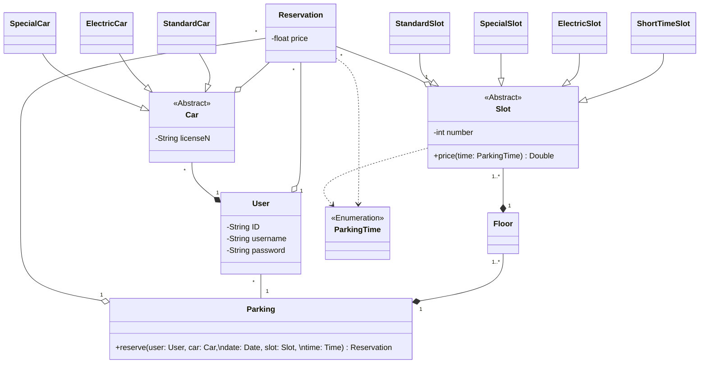

[# Parking Next
## Class Diagram:

```mermaid
classDiagram
    Floor "1..*" --* "1" Parking
    Slot "1..*" --* "1" Floor
    ShortTimeSlot --|> Slot
    ElectricSlot --|> Slot
    SpecialSlot --|> Slot
    StandardSlot --|> Slot
    User "*" -- "1" Parking
    Reservation "*" --o "1" Parking
    Reservation "*" --o "1" User
    Reservation "*" --o "1" Slot
    Reservation --o Car 
    Reservation ..> ParkingTime
    Slot ..> ParkingTime
    Car "*" --* "1" User
    StandardCar --|> Car
    ElectricCar --|> Car
    SpecialCar --|> Car

    class Parking{
        +reserve(user: User, car: Car,\ndate: Date, slot: Slot, \ntime: Time) Reservation
    }

    class Floor{

    }

    class Slot{
        <<Abstract>>
        -int number
        +price(time: ParkingTime) Double
    }

    class StandardSlot{

    }

    class ElectricSlot{

    }

    class SpecialSlot{

    }

    class ShortTimeSlot{

    }

    class User{
        -String ID
        -String username
        -String password
    }

    class Reservation{
        -float price
    }

    class ParkingTime{
        <<Enumeration>>
    }

    class Car{
        <<Abstract>>
        -String licenseN
    }

    class StandardCar{

    }

    class ElectricCar{

    }

    class SpecialCar{

    }
```
